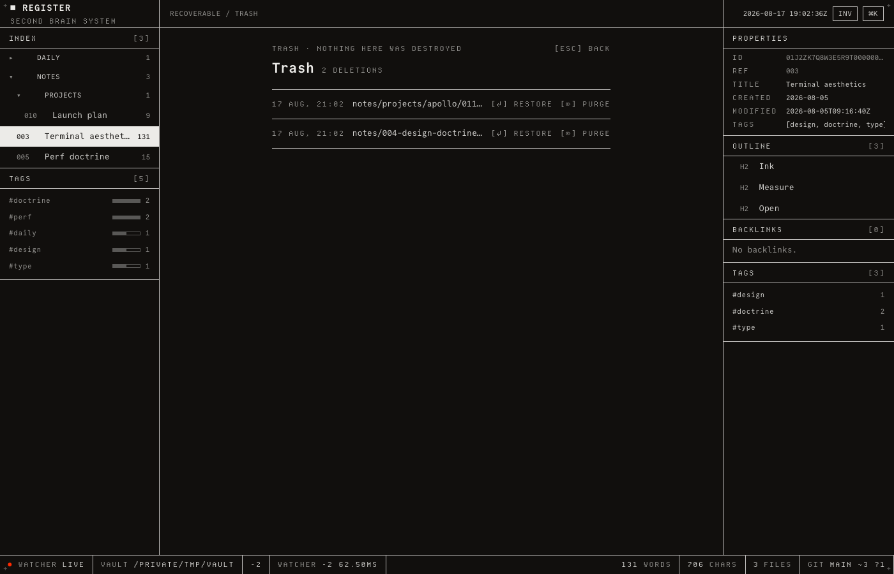

# REGISTER

A file-native second brain. Your knowledge base is a folder of plain markdown
files; one small Rust binary renders it as a fast, keyboard-first, terminal-grade
UI on localhost. You edit through the UI, agents edit the files, and a watcher
keeps both views identical within 100 ms.

- **Files are the truth.** No database, no hidden state. Backlinks, tags, tasks
  and the search index are computed on read and thrown away.
- **Agents are first-class.** Every vault carries a `CLAUDE.md` contract, so
  Claude Code works with it out of the box — no API, no plugin, no sync.
- **An instrument, not a lounge.** Monochrome, hairlines, one signal colour, zero
  animation. Latency is a material and the budgets are asserted in CI.

<picture>
  <source media="(prefers-color-scheme: dark)" srcset="docs/screenshot-dark.png">
  
</picture>

<sup>Both themes, because dark is *tuned per surface* rather than inverted — the
picture follows whichever one you read GitHub in.</sup>

## Run it

```sh
docker run -d --name register -p 127.0.0.1:7777:7777 \
  -v ~/vault:/vault ghcr.io/thijsvos/register:latest
```

Open <http://localhost:7777>. That is the whole of setup.

`~/vault` does not have to exist. Pointing the app at an empty or missing folder
scaffolds a vault into it and says what it wrote; pointing it at a folder that
already holds markdown changes nothing. Your notes are plain files on your own
disk — delete the container and they are still there.

On Linux add `--user $(id -u):$(id -g)`, or every note ends up owned by uid 1000.

**Prebuilt binaries** for macOS, Linux and Windows are on the
[releases page](https://github.com/thijsvos/register/releases) if you would
rather not use Docker:

```sh
register serve ~/vault        # UI on http://127.0.0.1:7777
```

Compose, building from source, and the container's internals:
[`docs/install.md`](docs/install.md).

## Using it

Everything is reachable from the keyboard, and every control prints its own key —
so this table is a convenience, not a manual.

| Key | Does |
|---|---|
| `⌘K` / `Ctrl-K` | Command palette — search, commands, templates |
| `⌘D` | Today's daily log |
| `G` `T` · `G` `I` | TODAY, every open task in the vault · the inbox, note `000` |
| `N` · `I` | New note · switch light ↔ dark |
| `[` · `]` | Toggle the index · the inspector |
| `Esc` · `↵` | Leave the editor · go back into it |
| `↑` `↓` · `j` `k` | Walk a list: index, outline, backlinks, TODAY |
| `→` `←` · `l` `h` | Open and fold a folder in the index |
| `⌫` · `N` | On an index row: delete what it names, or create a note inside it |

**⌘K is the whole navigation surface.** Real full-text search over note bodies,
not a filter over a fixed list; commands match as a subsequence, so `tgi` finds
TOGGLE INSPECTOR; and everything in `templates/` is offered under NEW FROM
TEMPLATE, where whatever you have typed becomes the new note's title.

**TODAY and the inspector store nothing.** TODAY re-derives every `- [ ]` in the
vault and ticking one writes through to that line in that file. The inspector
does the same for one note — properties, outline, backlinks, tags — recomputed
from the buffer as you type. Following a `[[wikilink]]` to a note that does not
exist creates it.

**Folders are made by writing into them.** There is no "new folder" command —
an empty folder is not something the index can show, because a folder exists
exactly while a note is under it. So `⌘K`, type `pr`, and it offers
`notes/projects`; choose it and the path is typed for you, then add a title. A
path that does not exist yet is created by the note that goes in it. `N` on a
focused index row puts the new note in that folder.

**Nothing is ever hard-deleted.** `⌫` on an index row asks a single question,
then moves the files to `.register/trash/<timestamp>/` keeping the paths they
had. A folder takes everything under it, images and PDFs included. Trashed notes
still count when the server hands out the next reference number, so a `[[003]]`
written last month can never quietly start pointing at different prose.

`GO · TRASH` in ⌘K shows what is in there and puts it back — folders and all,
recreating any that have since gone. A path something else now occupies is
skipped rather than overwritten, and the screen says so. Purging is the one
operation in the product that really destroys, and it is the only way a
reference number is ever handed out twice.

<picture>
  
</picture>

**Reorganising is not Finder's job.** `MOVE archive` in ⌘K renames or moves the
open note — or a whole folder — and the confirm says how many references it will
repoint before it touches one. Usually none: `[[wikilinks]]` resolve by title or
reference number rather than by path, so they survive a move untouched, and a
folder carries its images with it. Only a relative `` left behind
needs help, and it is kept relative.

**Files that are not notes have a home too.** `GO · ATTACHMENTS` lists every
image and PDF in the vault with the notes pointing at it — and marks the ones
nothing points at, which used to be invisible because the index is a register of
notes.

**The journal is a folder that stays shut.** `G` `D` opens today's log; the
DAILY folder in the index holds every other day, newest first, each row showing
its date and weekday. It costs one row until you open it, which is why a year of
daily logs doesn't bury the notes you actually filed.

**Settings** (`GO · SETTINGS` in ⌘K) keeps your own licensed font in
`.register/fonts/` and nothing in browser storage, because the vault is the only
state there is. Settings live in two files, split by what the setting is *about*:
the scheme, body face and display scale describe the machine you are sitting at
and go in `.register/local.json`, which `--git` ignores — so switching to dark no
longer makes your vault dirty. Collapsed folders and the checkpoint flag describe
the content, stay in `config.json`, and travel with it.

## Agents

Point one at the same folder and leave it running:

```sh
cd ~/vault && claude
```

Nothing syncs. The agent writes files, the app notices within 100 ms, and neither
side is a guest. The contract every vault carries is what makes this work without
an integration — see [`docs/agents.md`](docs/agents.md).

On macOS, **[Ledge](https://github.com/thijsvos/Ledge)** captures from the notch on
the same premise: type to file a line into today's log, or prefix with `/` to hand
the prompt to the same `claude` binary. It writes; REGISTER notices. A separate MIT
project, not part of this repo.

## What it promises

Budgets, not aspirations: each is asserted on every CI run, and a change that
breaks one gets smaller — the budget does not.

| Budget | Limit | Measured |
|---|---|---|
| Release binary | ≤ 10 MB | 3.3–4.3 MB depending on platform |
| Shell JS (initial) | ≤ 60 kB gz | 50.1 kB |
| Editor chunk (lazy) | ≤ 150 kB gz | 102.9 kB |
| Stylesheet | ≤ 10 kB gz | 4.8 kB |
| Agent edit → visible | ≤ 100 ms | asserted, real file write |
| Server start → editable | < 500 ms | asserted |

Idle RAM on a 1k-note vault, document-switch time and repository size are held
the same way. The full table and the reasoning are in `SPEC.html` §06.

## Remote access, and history

Off by default, and neither adds an account or any telemetry. REGISTER can commit
your vault for you if it is a git repository, and can serve beyond localhost
behind a token — Tailscale is the intended shape. Both in
[`docs/remote.md`](docs/remote.md).

## More

- **[`SPEC.html`](SPEC.html)** — the contract. Vault format, design system,
  screens, budgets, phases. Everything here is downstream of it.
- **[`CONTRIBUTING.md`](CONTRIBUTING.md)** — scope fence, how ideas get parked
  and promoted, what "green" means.
- **[`docs/ROADMAP.md`](docs/ROADMAP.md)** — everything deliberately not built
  yet, with the trigger that would change that.
- **[`docs/ADRs/`](docs/ADRs)** — decisions that needed an argument.

Built with Claude Code, phase by phase, against `SPEC.html` §08.

## Fonts

Three faces ship here, all **SIL OFL 1.1** with their `OFL.txt` beside them:
**Commit Mono** (UI and body), **Departure Mono** (the 11px micro layer) and
**Server Mono** (an alternate "teletype" body theme).

**Berkeley Mono / TX-02 is commercial and is never bundled.** It sits first in
the stack and resolves to nothing unless *you* own it; Settings → BYOF loads your
licensed file from your own disk into your own vault, which `register init --git`
puts in `.gitignore`. The bytes never leave your machine. (Not legal advice; read
the licences.)

## License

MIT (code) · SIL OFL 1.1 (bundled fonts).
