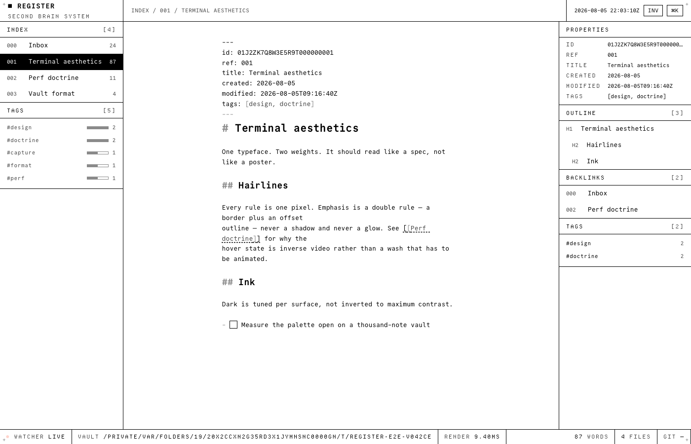

# REGISTER

A file-native second brain. Your entire knowledge base is a folder of plain
markdown files; a single small Rust binary (`register serve ~/vault`) renders it
as a fast, keyboard-first, terminal-grade UI on localhost. Humans edit through
the UI, agents edit the files directly, and a watcher keeps both views identical
within 100 ms.

- **Files are the truth.** No database, no hidden state. Every capability of the
  UI is a plain file edit; derived data (backlinks, tasks, index) is computed,
  never stored.
- **Agent-compatible by construction.** `register init` writes a `CLAUDE.md`
  agent contract into every vault, so Claude Code works with it out of the box.
- **Instrument, not lounge.** Engineering-grade monochrome, one typeface family,
  1px hairlines, a single signal color for live status. Latency is a material:
  16 ms interactions, sub-100 ms agent-edit-to-paint, enforced in CI.

V1 ships five things to instrument grade — notes, links, tags, tasks, search —
and stages everything else (§12). The full contract is in **`SPEC.html`**.



## The thesis

Every note-taking app eventually asks you to trust its database. REGISTER does
not have one. Your notes are the files; everything else — backlinks, tags, the
task list, the search index — is computed on read and thrown away.

That is not asceticism, it is what makes an agent a first-class editor. Claude
Code does not need an API, a plugin or a sync protocol to work with your vault;
it needs a folder and a contract, and `register init` writes the contract into
the folder. A human edits through the UI, an agent edits the files, and a
watcher keeps both views identical inside 100 ms. Neither side is a guest.

The design follows from the same idea. If files are the truth, the interface is
an instrument for reading them, not a place things live — so it is monochrome,
hairlined, keyboard-first, and free of animation that would cost latency for
decoration.

## Budgets

Not aspirations. Every one is asserted in CI, and the measured figure is what
the last commit actually produced.

| Budget | Limit | Measured | Enforced by |
|---|---|---|---|
| Release binary | ≤ 10 MB | 2.96 MB | `release.yml` per platform |
| Shell JS (initial) | ≤ 60 kB gz | 37.3 kB | `size-limit` |
| Editor chunk (lazy) | ≤ 150 kB gz | 101.3 kB | `size-limit` |
| Idle RAM, 1k notes | ≤ 50 MB | asserted | Playwright + `ps` |
| Agent edit → visible | ≤ 100 ms | asserted | Playwright, real file write |
| Document switch | < 16 ms | asserted | status-bar RENDER + Playwright |
| Server start → editable | < 500 ms | asserted | Playwright |
| Repository size | < 5 MB | asserted | CI `git count-objects` |

If a change breaks a budget, the change shrinks. Not the budget.

## Running it

Two modes. Native is the primary one; the container exists for a home server or
a tailnet, where you want the UI on every device and the vault in one folder.

### Native

```sh
register init ~/vault --git   # scaffold: folders, CLAUDE.md, .gitignore, git repo
register serve ~/vault        # UI on http://127.0.0.1:7777
```

Then, in another terminal, point an agent at the same folder:

```sh
cd ~/vault && claude
```

Nothing syncs between them. The agent writes files; the app notices, within
100 ms. See [`docs/agents.md`](docs/agents.md).

`register serve` binds to loopback unless told otherwise. `register new "Title"`
creates a conforming note from inside a vault and prints its path.

**Installing.** Until the first tagged release, build it yourself:

```sh
cd app && pnpm build          # the UI is embedded in the binary
cd .. && cargo install --path . --force
```

The `--force` matters: without it `cargo install` silently does nothing when the
version has not changed, and you keep running the binary you built last time.

From v1.0 onward: prebuilt binaries on the GitHub release page for macOS
(arm64/x64), Linux (x64/arm64, musl) and Windows x64, or `cargo install
register-notes`.

### Container

```sh
VAULT_PATH=~/vault docker compose -f deploy/docker-compose.yml up -d
```

Serves on `http://localhost:7777` against the folder you mounted. The image is
three stages down to `scratch`, so it is the binary and nothing else — no shell,
no package manager, a few megabytes.

Two things worth knowing before you publish that port:

- The container binds `0.0.0.0` because a published port needs it, not because
  the server is meant to be reachable from a network. The Origin and Host guards
  still hold, and `/api/reveal` refuses outright on a non-loopback bind — but
  putting this on a network is a decision. Behind Tailscale is the intended
  shape.
- Agents still run on the **host**, against the same mounted folder. The
  container only serves the UI.

Images are published to `ghcr.io/OWNER/register` on tags, addressable by version
only — there is no `latest`, deliberately, because nothing should depend on a
tag that moves under it.

## Build status
Under construction with Claude Code, phase by phase per `SPEC.html` §08.

## For contributors / agents
Read `SPEC.html` end to end first, then `CLAUDE.md`. `register-prototype.html` is
the visual + interaction reference. The build runs phase by phase per §08.

```
cargo run -- health                # server toolchain
cd app && pnpm install && pnpm dev # UI toolchain
```

## Contributing
See [`CONTRIBUTING.md`](CONTRIBUTING.md) for the v1 scope fence, the
park-and-promote process, and what "green" means.

## Fonts and licensing

Three faces ship in this repository, all **SIL OFL 1.1**, each with its
`OFL.txt` beside it:

| Face | Role |
|---|---|
| **Commit Mono** | default UI and body |
| **Departure Mono** | the micro layer — labels, status bar, on an 11px pixel grid |
| **Server Mono** | the alternate "teletype" body theme |

**Berkeley Mono / TX-02 is commercial and is never bundled.** U.S. Graphics
states its licences are not compatible with open-source apps and generally
disallows embedding in editors. It sits first in the font stack and resolves to
nothing unless *you* own it — Settings → BYOF loads your licensed file from your
own disk into your own vault, under `.register/fonts/`, which `register init
--git` puts in `.gitignore`. The bytes never leave your machine and are never
committed. (Not legal advice; read the licences.)

## License
MIT (code) · SIL OFL 1.1 (bundled fonts).
